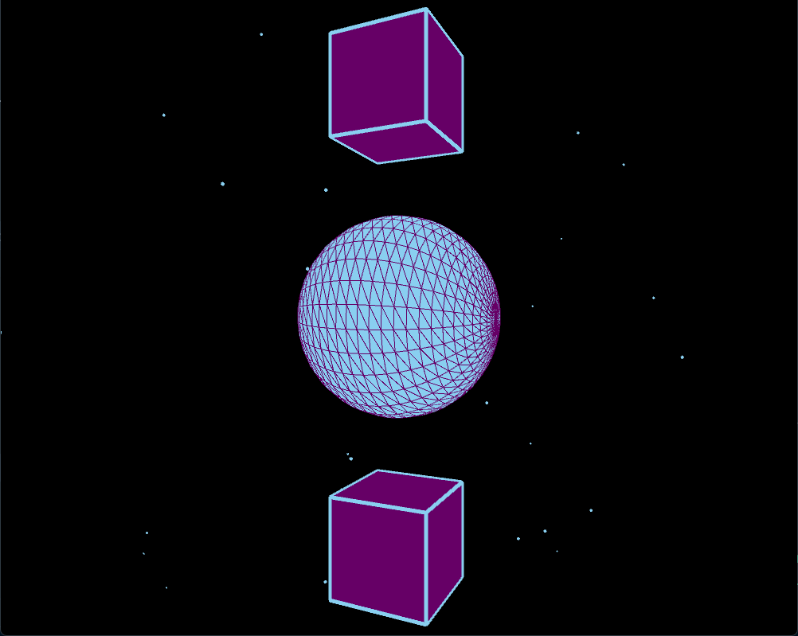
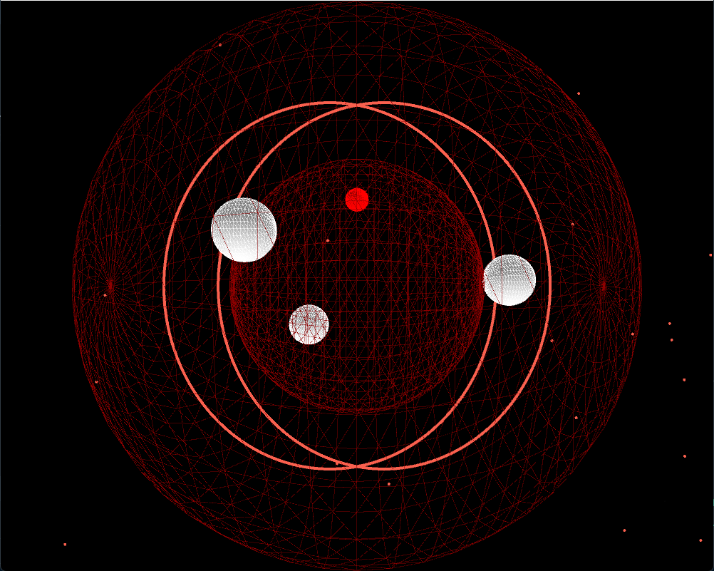

# Music Visualiser Project

Student Number: C21416022 (Bakht Zia Khan), C21716601 (Emil Roy), C21388736 (Nicolas Ruth)

At first we used a different repository to complete this project because of a forking issue among the group. I commited all the code to this repository when we completed the assignment. This is the link to that repository:
https://github.com/emilroy4/MV-C21716601 

# Description of the assignment
Assignment Brief: In this creative coding team project, you will work in a team of up to four, to create an abstract visual story of a song. You will use Processing, Minim or the Processing Sound library to create audio responsive elements and Github to manage your project. You will create a program that responds to the audio of a chosen song and generates a visually compelling and abstract representation of the song's mood, tempo, and structure. The program should showcase your teamwork, creativity, technical skills, and ability to effectively communicate emotions and narrative through visual elements.


# Instructions
Press F5 to see the Music Visual.
Press Space to start the Visual and press the numbers 1 to 5 to change visuals.


# How it works
The Main.java file is the main file that runs everything on the program. When you press F5 to run the code, main calls on rockstar.java. The file rockstar.java calls on all the visuals, and allows the user to flick through them using the keys 1-5. The way this works is that the other classes use inheritance to call on the super/parent class. To do this the word extends is used. 

In the setup method, objects are created in rockstar.java.

```Java
public void setup()
    {
        startMinim();

        loadAudio("immortal.mp3");

        er = new emil(this);
        er1 = new emil1(this);
        bakht = new bakht(this);
        nico = new nico(this);
        us = new us(this);
        us1 = new us1(this);
        visual6 = new visual6(this);


        colorMode(RGB);
    }
```

In the draw method, the variable and the method used to created the visuals are called and to this we used a switch statement:

```Java
public void draw()
    {
        background(0);
        try
        {
            // Call this if you want to use FFT data
            calculateFFT(); 
        }
        catch(VisualException e)
        {
            e.printStackTrace();
        } 
        // Call this is you want to use frequency bands
        calculateFrequencyBands(); 

        // Call this is you want to get the average amplitude
        calculateAverageAmplitude();

        switch(v)
        {
            case 1:
            {
                bakht.render();
                break;
            }

            case 2:
            {

                er.render();
                er1.render();

                break;
            }

            case 3:
            {
                
                nico.render();
                break;
            }

            case 4:
            {

                visual6.render();

                break;
            }

            case 5:
            {

                us1.render();
                us.render();

                break;
            }


        }
    }
```

Pressing from 1 to 5 will display one of the visuals we created. When you press to move onto the next key, you should see a new shape that also interacts with the song. These visuals range from spinning hoops to a colourful cube.

# What we are most proud of in the assignment
We are proud in our team's accomplishment of completing this music visual project. At the start of the project, we thoroughly analyzed the assignment brief, dissecting it into manageable tasks that we could individually work on. Our team collaborated proficiently, regularly discussing our progress, brainstorming ideas, and offering constructive feedback to one another. Diligently utilizing our technical skills in Processing, Minim, and Github, we created an audio-responsive program that effectively conveyed our chosen song's mood, tempo, and structure. We experimented with various visual elements, refined our code, and iterated on our design until we produced five visually stimulating and abstract representation of the song, showcasing our creativity and storytelling capabilities. This project allowed us to sharpen our teamwork, creativity, and technical skills, and we are proud of the program we produced as a team.


# Code

This is the code we used to switch between the visuals. We decided to use a switch statement as we believe it is efficient and simple to code.

```Java
  switch(v)
        {
            case 1:
            {
                bakht.render();
                break;
            }

            case 2:
            {

                er.render();
                er1.render();

                break;
            }

            case 3:
            {
                
                nico.render();
                break;
            }

            case 4:
            {
            
                visual6.render();

                break;
            }

            case 5:
            {

                us1.render();
                us.render();

                break;
            }


        }
```


This is the code to render case 1:
```Java
   public void render() {

  // set background color
  if (bakht.frameCount % 120 < 60) {
    bakht.background(100, 0, 0); // dark red
  } else {
    bakht.background(0); // black
  }

// Draw the middle white circle
bakht.stroke(255);
bakht.fill(255);
bakht.circle(0, 0, 20);


if (bakht.frameCount % 120 < 60) {
 bakht.stroke(255, 0, 0); // set stroke color to red
 bakht.fill(0); // set fill color to red
 bakht.circle(0, 0, 10);} 
 else {
  bakht.background(0); // black
  bakht.stroke(255, 0, 0); // set stroke color to red
 bakht.fill(255, 0, 0); // set fill color to red
 bakht.circle(0, 0, 10);
 
}

// draw the circles
bakht.noFill();
bakht.camera(0, 100, 200, 0, 0, 0, 1, 0, 0);
bakht.translate(0, 0, 0);
bakht.strokeWeight(4);

// Calculate the position of the three circles around the center circle
float angle = bakht.radians(bakht.frameCount * 2);
float[] x = new float[4];
float[] y = new float[4];
for (int i = 0; i < 4; i++) {
    x[i] = 60 * bakht.cos(angle + i * bakht.radians(120));
    y[i] = 60 * bakht.sin(angle + i * bakht.radians(120));
}

// Draw the three white circles
for (int i = 0; i < 3; i++) {
    bakht.stroke(255);
    bakht.fill(255);
    bakht.circle(x[i], y[i], 20);

 // Draw a solid red circle inside the white circle
  // Set color of the red circles based on the background color
  if (bakht.frameCount % 120 < 60) {
    bakht.stroke(0); // set stroke color to black when background is dark red
    bakht.fill(0); // set fill color to black when background is dark red
    bakht.circle(x[i], y[i], 10); // draw the red circle at the same position as the white circle
  } else {
    bakht.stroke(255, 0, 0); // set stroke color to red when background is black
    bakht.fill(255, 0, 0); // set fill color to red when background is black
    bakht.circle(x[i], y[i], 10); // draw the red circle at the same position as the white circle
  }
}

        // draw the hollow circles that expand
        bakht.noFill();
        bakht.translate(0, 0, 0);
        bakht.strokeWeight(4);
    
        bakht.noFill();
        bakht.camera(0, 0, 200, 0, 0, 0, 5, 0, 0);
        bakht.translate(0, 0, 0);
        bakht.strokeWeight(2);
    
        float[] b2 = bakht.getSmoothedBands();
        for(int i=0; i<b2.length ; i++)
        {
            float c = PApplet.map(i, 255, b2.length, 50, 150);
            if(i == 2){
                bakht.stroke(200, 200, 200); // set stroke color to blue for band index 2
            }
            else{
                bakht.stroke(200, 200, 200); // set stroke color for other bands
            }
            float s = b2[i];
            bakht.pushMatrix();
            bakht.circle(0, 0, s);
            bakht.popMatrix();
        }
        if (bakht.frameCount % 60 == 0){ // every 60 frames
            bakht.stroke(100); // set stroke color to white
        }
}

```

This is the code to render case 5:
```Java
 public void render()
    {
        float[] stars = new float[500];
        for (int i = 0; i < stars.length; i++) {
            stars[i] = us.random(-us.width, us.width);
        }

        us.stroke(4);
        for (int i = 0; i < stars.length; i++) {
            float speed = us.map(us.getSmoothedAmplitude(), 0, 1, 1, 5);
            stars[i] += speed;
            if (stars[i] > us.width) {
                stars[i] = us.random(-us.width, 0);
            }
            us.point(stars[i], us.random(-us.height, us.height));
        }

        us.stroke(140, 0, 0);//red colour
        rotation += us.getAmplitude() / 5f;
        us.rotateY(rotation);
        
        us.lights();
        us.strokeWeight((float) 0.5);
        us.pushMatrix();
        us.sphere(50); // draw a smaller white sphere
        us.sphere(100); // draw a larger white sphere
        us.popMatrix();
        

        // Calculate the position of the three circles around the center circle
float angle = us.radians(us.frameCount * 2);
float[] x = new float[4];
float[] y = new float[4];
for (int i = 0; i < 4; i++) {
    x[i] = 60 * us.cos(angle + i * us.radians(120));
    y[i] = 60 * us.sin(angle + i * us.radians(120));
}

for (int i = 0; i < 4; i++) {
    // Draw white sphere
    us.stroke(255);
    us.fill(255);
    us.pushMatrix();
    us.translate(x[i], y[i], 0);
    us.sphere(10);
    us.popMatrix();
    
    // Draw red sphere inside the white sphere
    us.stroke(255, 0, 0); // set stroke color to red
    us.fill(255, 0, 0); // set fill color to red
    us.pushMatrix();
    us.translate(x[i], y[i], 0);
    us.sphere(5);
    us.popMatrix();
    
    // Draw rotating red sphere in the center of the white sphere
    us.stroke(255, 0, 0); // set stroke color to red
    us.fill(255, 0, 0); // set fill color to red
    us.pushMatrix();
    us.translate(0, 0, -40); // move the sphere back in z direction
    us.rotateZ(us.radians(us.frameCount)); // rotate around z-axis based on frame count
    us.sphere(5);
    us.popMatrix();
}


}


```


# Images
Case 1:


Case 2:


Case 3:

Case 4:

Case 5:



# Youtube Video:
[
)(https://www.youtube.com/watch?v=gzYQpCLaQWw)

